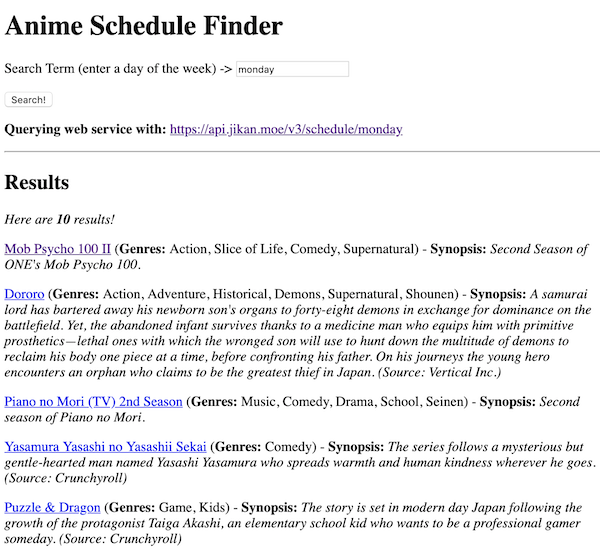
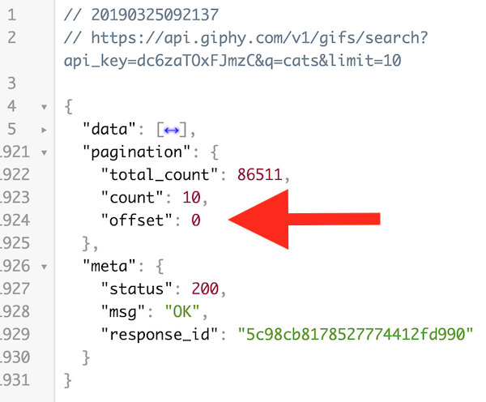
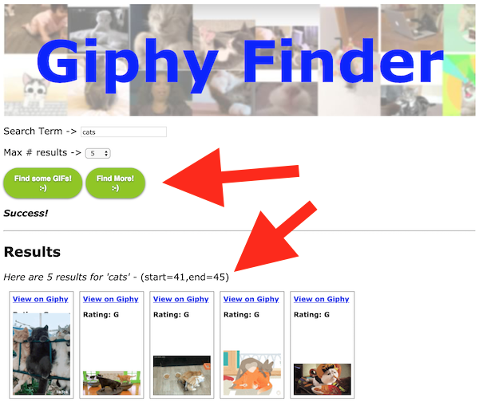

# Week 10B - Web Services Review

<a id="review"/>

## I. Review: wrap-up of "unit 2"
- We just completed 3-1/2 lectures about working with [**Unstructured Text**](https://en.wikipedia.org/wiki/Unstructured_data) - by both analyzing it and by creating [**Generative Text**](https://en.wikipedia.org/wiki/Generative_art) experiments. Here is a summary of the concepts, topics and exercises:
  - loading text via &lt;input>, &lt;textarea>, &lt;file>, drag-and-drop, and also via the `XMLHttpRequest` object (XHR)
  - manipulating text using `String` and `Array` methods, as well as regular expressions
  - creating a [*Palindrome Detector*](https://github.com/tonethar/IGME-330-Master/blob/master/notes/HW-palindrome-detector.md) - palindromes are a form of [**Constrained Writing**](https://en.wikipedia.org/wiki/Constrained_writing)
  - creating a [*Diastic Machine*](https://github.com/tonethar/IGME-330-Master/blob/master/notes/text-2.md#III) demo in class, which was another example of Constained Writing
  - learning about how to count all of the words on a page, how to designate and remove words we are not interested in ([**Stop Words**](https://en.wikipedia.org/wiki/Stop_words)) by utilizing array methods, and then making our own [*Word Cloud*](https://github.com/tonethar/IGME-330-Master/blob/master/notes/HW-word-cloud.md) app
  - utilizing the [RiTa.js](http://rednoise.org/rita/) library to analyze text for the parts-of-speech of words, and saw how to query the library for random words of the same part of speech, and similar sounding words. With this information we created a [*Maddening Libs*](https://github.com/tonethar/IGME-330-Master/blob/master/notes/text-4.md#III) web app. We also saw that RiTa can be used to singularize/pluralize word and for verb conjugation
  - finally, we learned about how to use RiTa to specify a *grammar*, *terminal* and *non-terminal* symbols, and *production rules*. We looked at a [Haiku](https://grammar.yourdictionary.com/style-and-usage/rules-for-writing-haiku.html) demo, and we created a fantasy place name generator that utilized a grammer, [*HW - ill-Favored Coast*](https://github.com/tonethar/IGME-330-Master/blob/master/notes/text-5.md#V) 
- Let's quickly review the *Maddening Libs* and *ill-Favored Coast* homework
- P.S. We're not *quite* done with this text unit. Once we learn how to program some server-side JavaScript in Node.js (next week) we'll go ahead and create a [Twitter Bot](https://twitter.com/CarlosD46246555), and then push it up to [Heroku](https://www.heroku.com/).
  

## II. Overview
- We are now moving into the third part of the course, where we will build data-driven applications utilizing web services. In the next few weeks we will cover the following concepts:
  - intro (or review for some of you) of using web services both in the browser, and in a command-line application
  - creating our own web service
  - utilizing multiple web services (such as google maps) to build a web service *mashup*
  - storing data in the "cloud" via Firebase
  - *data binding* - learning how to utilize "reactive" frameworks like Vue.js

## III. Today's Topics
- ***But first, a public service announcement about today's lecture***:
  - If you took IGME-230 *Web Site Design & Implementation* prior to 2171, you have not seen this material before
  - If you took IGME-230 in 2171 or 2175, this was *optional* material that you may have seen if you decided to do a Web Service App for Project 2
  - If you took IGME-230 in 2181 or later, this was required material, therefore much of today's lecture will be review
- Consuming Web Services in a browser:
  - [Web Apps - Part 10 (IGME-230)](https://github.com/tonethar/IGME-230-Master/blob/master/notes/web-apps-10.md) - we will review these IGME-230 notes. Here's a question for you - what's the general difference between a *library* like RiTa.js, and a *web service* (such as Giphy)?
  - [Web Service App - Examples & Starters (IGME-230)](https://github.com/tonethar/IGME-230-Master/blob/master/notes/web-service-app-starters.md) - this is starter code that demos how to use several web services
  - [HW - GIF Finder](https://github.com/tonethar/IGME-230-Master/blob/master/notes/HW-gif-finder.md) - you should have completed this already:
    - We are going to review the concepts together - if you have any questions about it - ask!
    - If your version was not perfect, fix it!
    - And if you didn't complete this HW assignment, do so ASAP!
 
 ## IV. Demos
 For demos, we'll utilize 2 services:
 
 ### IV-A. Dog API
 - Docs are here: https://dog.ceo/dog-api/documentation/
 - Grab the demo start code [here](https://github.com/tonethar/IGME-230-Master/blob/master/notes/web-service-app-starters.md#random-dog) - and be sure to copy **dog-xhr.html** (the XHR version)
     - try out the start version - notice that this API endpoint is pretty simple to use because it does not require us to send any additional parameters along
     - as we have seen before, `xhr.send()` puts the request code on a background thread, and is thus *asynchronous* (meaning that multiple things can happen at the same time), and the UI will stay responsive while the JSON file is being downloaded from the Internet
     - how long does it take to download this file?
       - Let's use `console.time("downloadData")` and `console.timeEnd("downloadData")` to find out
       - https://developer.mozilla.org/en-US/docs/Web/API/Console/time
     - now we will modify the code to utilize the "List all breeds" API endpoint (see Dog API docs link above)
       - first get just the "top-level" breeds to show
       - then be sure that the sub-breeds are also displayed
       - note: this endpoint also does not require any additional parameters
       - see screenshot below:

### IV-B. Anime Schedule Finder API

- Docs are here: https://jikan.docs.apiary.io/#
 - Grab the demo start code [here](https://github.com/tonethar/IGME-230-Master/blob/master/notes/web-service-app-starters.md#anime-schedule-finder) - and be sure to copy **anime-schedule-xhr.html** (the XHR version)
     - try out the start version - note that we are getting a `url` and a `title` for each result -  which allows us to create a hyperlink to the result's web page
     - modify the code to also display the `synopsis` of the show
     - modify the code to display the `.name` of all of the `.genres` that the show belongs to
     - see screenshot below:

## V. Homework - Improved GIF Finder
A really nice feature that all web apps have is ability to allow the user to "page" through large numbers of results. Unfortunately, in our current version of [GIF Finder](https://github.com/tonethar/IGME-230-Master/blob/master/notes/HW-gif-finder.md), did you notice that we always get the same 25 "cat" GIFs back when we search? Let's fix that!

- Add a "Find More!" button to your GIF Finder HW - here are some hints:
  - the `offset` API parameter is what controls the "start index" of the results. Because we have not supplied a value for this, it always defaults to `0` - see screenshot below:
  
 
  
- so we need to pass an `offset` parameter to the query string, and increase the `offset` every time the "Find More!"  is clicked - hints:
  - Declare a script variable - `let offset = 0;`
  - Append its value to the query string  - `url += "&offset=" + offset;`
  - Increase the value of `offset` by the `limit` value every time the "Find More!" button is clicked, and then do a search
  - Re-set the value of `offset` to `0` every time the "Find some GIFs!" button is clicked
  - `e.target.id` is a good way to figure out which button called `searchButtonClicked()`
  - Display the `offset` value somewhere on the screen (see the screenshot)
  - "Gotchas":
    - when you pull the `limit` value from the form, it is of type `String`. Before you can perform mathematical operations with it, you will need to convert it to a `Number`
    - you should probably set the `disabled` property of the "Find More!" to `true` when the app starts up, and then set it to `false` after the first successful search
  - Here is a completed example:   
    

## VI. Lists of Public APIs
- https://github.com/toddmotto/public-apis
- https://github.com/abhishekbanthia/Public-APIs

| <-- Previous Unit | Home | Next Unit -->
| --- | --- | --- 
| [**week-10A-notes.md**](week-10A-notes.md)     |  [**IGME-330 Schedule**](../schedule.md) | [**week-11A-notes.md**](week-11A-notes.md)
